# Documentation Index - Multimodal AI Medical Agent
## Complete Documentation in Hinglish

## 📊 System Flow Diagram (सिस्टम फ्लो डायग्राम)

### Technical Architecture Diagram (तकनीकी आर्किटेक्चर)

**TECHNICAL ARCHITECTURE**

```mermaid
flowchart TB
    subgraph Header[" "]
        Title[TECHNICAL ARCHITECTURE]
        TechLogos[Groq | OpenAI]
    end
    
    subgraph Phase4["PHASE 4: USER INTERACTION / INTERFACE"]
        direction TB
        UserSpeech[👤 User Speech Input<br/>Microphone Recording]
        ImageUpload[📷 Upload Image<br/>Medical Image]
        AudioOutput[🔊 Audio Output<br/>Doctor's Voice Response]
        GradioLogo[Gradio]
    end
    
    subgraph Phase2["PHASE 2: SPEECH INPUT PROCESSING"]
        direction TB
        AudioRecorder[Audio Recorder<br/>Capture Audio File]
        STTModel[Speech to Text<br/>STT AI Model<br/>Groq Whisper<br/>whisper-large-v3-turbo]
    end
    
    subgraph Phase1["PHASE 1: CORE PROCESSING & LLM"]
        direction TB
        TranscribedText[Transcribed Text<br/>User Query<br/>Patient Description]
        VisionModel[👁️ Vision Model<br/>Image Analysis<br/>Groq Vision API<br/>llama-3.2-90b-vision-preview]
        LLMResponse[💬 LLM Response<br/>Medical Diagnosis<br/>Groq LLM<br/>llama-3.3-70b-versatile]
        GroqLogo1[Groq]
        MetaLogo[Meta]
    end
    
    subgraph Phase3["PHASE 3: AUDIO OUTPUT GENERATION"]
        direction TB
        TTSModel[Text to Speech<br/>TTS AI Model<br/>ElevenLabs / gTTS]
        AudioFile[Audio output file<br/>final.mp3]
        ElevenLabsLogo[ElevenLabs]
    end
    
    %% Header
    Title --> Phase4
    TechLogos -.-> Phase1
    
    %% Flow: Phase 4 to Phase 2
    UserSpeech -->|Audio Input| AudioRecorder
    ImageUpload -->|Image Input| VisionModel
    
    %% Flow: Phase 2 to Phase 1
    AudioRecorder -->|Audio File| STTModel
    STTModel -->|Transcribed Text| TranscribedText
    
    %% Flow: Phase 1 internal
    TranscribedText -->|Text Query| VisionModel
    VisionModel -->|Image + Text Analysis| LLMResponse
    
    %% Flow: Phase 1 to Phase 3
    LLMResponse -->|Diagnosis Text| TTSModel
    
    %% Flow: Phase 3 to Phase 4
    TTSModel -->|Generated Audio| AudioFile
    AudioFile -->|Audio Output| AudioOutput
    
    %% Logo connections (dashed)
    GroqLogo1 -.->|API| VisionModel
    GroqLogo1 -.->|API| LLMResponse
    GroqLogo1 -.->|API| STTModel
    MetaLogo -.->|Models| VisionModel
    MetaLogo -.->|Models| LLMResponse
    ElevenLabsLogo -.->|TTS| TTSModel
    GradioLogo -.->|UI| UserSpeech
    GradioLogo -.->|UI| ImageUpload
    GradioLogo -.->|UI| AudioOutput
    
    style Header fill:#fff,stroke:none
    style Title fill:#fff,stroke:#1976d2,stroke-width:3px,font-size:20px,font-weight:bold
    style Phase4 fill:#ffb3d9,stroke:#ff69b4,stroke-width:4px,color:#000
    style Phase2 fill:#c8e6c9,stroke:#4caf50,stroke-width:4px,color:#000
    style Phase1 fill:#ffe0b2,stroke:#ff9800,stroke-width:4px,color:#000
    style Phase3 fill:#bbdefb,stroke:#2196f3,stroke-width:4px,color:#000
    style UserSpeech fill:#ffb3d9
    style ImageUpload fill:#ffb3d9
    style AudioOutput fill:#ffb3d9
    style AudioRecorder fill:#c8e6c9
    style STTModel fill:#c8e6c9
    style TranscribedText fill:#ffe0b2
    style VisionModel fill:#ffe0b2
    style LLMResponse fill:#ffe0b2
    style TTSModel fill:#bbdefb
    style AudioFile fill:#bbdefb
    style GroqLogo1 fill:#fff,stroke:#ff6b35,stroke-width:2px
    style MetaLogo fill:#fff,stroke:#0081fb,stroke-width:2px
    style ElevenLabsLogo fill:#fff,stroke:#000,stroke-width:2px
    style GradioLogo fill:#fff,stroke:#ff6b35,stroke-width:2px
```

**Data Flow Explanation:**
1. **User Input** (Phase 4) → Audio/Image capture
2. **Speech Processing** (Phase 2) → Audio → Text transcription
3. **Core Processing** (Phase 1) → Text + Image → Vision Analysis → LLM Diagnosis
4. **Audio Output** (Phase 3) → Diagnosis Text → Speech → Audio File
5. **User Output** (Phase 4) → Audio playback to user

### Complete Workflow Flowchart


### Simplified Component Flow


### Data Flow Diagram

```mermaid
flowchart LR
    subgraph Input["📥 Input Layer"]
        A1[Audio File]
        A2[Image File]
        A3[Patient ID]
    end
    
    subgraph Processing["⚙️ Processing Layer"]
        B1[Audio Transcription<br/>Whisper API]
        B2[Image Analysis<br/>Vision API]
        B3[History Retrieval<br/>SQLite]
    end
    
    subgraph Fusion["🔀 Fusion Layer"]
        C1[Prompt Building]
        C2[LLM Generation]
        C3[Fallback Logic]
    end
    
    subgraph Decision["🎯 Decision Layer"]
        D1[Confidence Calculation]
        D2[Triage Decision]
    end
    
    subgraph Output["📤 Output Layer"]
        E1[Text Formatting]
        E2[Voice Generation]
        E3[UI Display]
        E4[Chat Interface]
    end
    
    Input --> Processing
    Processing --> Fusion
    Fusion --> Decision
    Decision --> Output
    
    style Input fill:#e1f5ff
    style Processing fill:#fff4e1
    style Fusion fill:#e1ffe1
    style Decision fill:#f0e1ff
    style Output fill:#ffe1f5
```



### Phase-wise Flow


---

### 📚 Documentation Files

#### Main Comprehensive Document
- **[00_COMPLETE_WORKFLOW.md](./00_COMPLETE_WORKFLOW.md)** - **START HERE!** Complete system workflow with phase-wise explanations

#### Individual File Documentation

1. **[01_gradio_app.md](./01_gradio_app.md)** - Main UI application (Gradio interface)
2. **[02_brain_of_the_doctor.md](./02_brain_of_the_doctor.md)** - LLM client and image analysis
3. **[03_voice_of_the_patient.md](./03_voice_of_the_patient.md)** - Audio transcription (Speech-to-Text)
4. **[04_voice_of_the_doctor.md](./04_voice_of_the_doctor.md)** - Text-to-Speech functionality
5. **[05_api_local.md](./05_api_local.md)** - Main orchestration and parallel processing
6. **[06_fusion_service.md](./06_fusion_service.md)** - Medical diagnosis fusion logic
7. **[07_confidence_service.md](./07_confidence_service.md)** - Confidence calculation and triage
8. **[08_history_service.md](./08_history_service.md)** - Patient history management
9. **[09_medical_agent_prompt.md](./09_medical_agent_prompt.md)** - LLM prompt template

---

## 🚀 Quick Start Guide

### For Understanding the System
1. Read **[00_COMPLETE_WORKFLOW.md](./00_COMPLETE_WORKFLOW.md)** first
2. Then read individual files as needed for specific components

### For Code Understanding
- Each file has **line-by-line explanations** in Hinglish
- Code examples included
- Workflow diagrams provided

### For Development
- Start with **[01_gradio_app.md](./01_gradio_app.md)** for UI
- Check **[05_api_local.md](./05_api_local.md)** for main logic
- Review service files for specific functionality

---

## 📋 Documentation Structure

Each documentation file contains:

1. **Overview** - File ka purpose
2. **Main Responsibilities** - Key functions
3. **Line-by-Line Explanation** - Detailed code explanation
4. **Workflow** - How it works
5. **Key Features** - Important points
6. **Dependencies** - Required libraries
7. **Usage Examples** - Code examples
8. **Integration** - Where it's used

---

## 🔍 Finding Information

### By Functionality
- **UI/Interface**: `01_gradio_app.md`
- **LLM/AI**: `02_brain_of_the_doctor.md`, `09_medical_agent_prompt.md`
- **Audio**: `03_voice_of_the_patient.md`, `04_voice_of_the_doctor.md`
- **Processing**: `05_api_local.md`, `06_fusion_service.md`
- **Decision Making**: `07_confidence_service.md`
- **Data Storage**: `08_history_service.md`

### By Phase
- **Setup**: `00_COMPLETE_WORKFLOW.md` - Phase 1
- **Input Processing**: `00_COMPLETE_WORKFLOW.md` - Phase 2
- **Analysis**: `00_COMPLETE_WORKFLOW.md` - Phase 3
- **Assessment**: `00_COMPLETE_WORKFLOW.md` - Phase 4
- **Output**: `00_COMPLETE_WORKFLOW.md` - Phase 5
- **Chat**: `00_COMPLETE_WORKFLOW.md` - Phase 6

---

## 💡 Tips for Reading

1. **Start with Complete Workflow** - Overall understanding ke liye
2. **Read Individual Files** - Specific components ke liye
3. **Check Code Examples** - Implementation ke liye
4. **Review Workflows** - Process flow ke liye

---

## 📝 Language

All documentation is in **Hinglish** (Hindi-English mix) for easy understanding:
- Technical terms in English
- Explanations in Hindi/English mix
- Code comments in English
- Examples in both languages

---

## 🎯 Key Concepts Explained

- **Multimodal Processing** - Audio + Image handling
- **Parallel Processing** - Speed optimization
- **LLM Integration** - AI diagnosis generation
- **Fallback Mechanisms** - Error resilience
- **Session Management** - State handling
- **Real-time Chat** - Interactive consultation

---

## 📞 Support

For questions or clarifications:
1. Check the relevant documentation file
2. Review code examples
3. Check the complete workflow document

---

**Happy Coding! 🚀**

